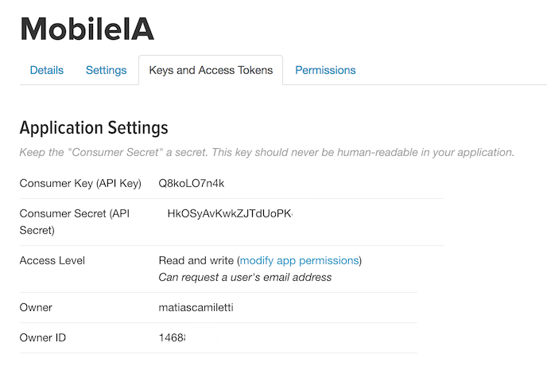

# MobileIA Twitter

## Como usar

1. Crear aplicación en Twitter (Ver abajo.)
2. Incluir librería
```gradle
compile 'com.mobileia:twitter:0.0.1'
```
3. Incluir las claves en el archivo strings.xml de tu aplicación
```xml
<string name="com.twitter.sdk.android.CONSUMER_KEY">Q8koLO4kwvCOEs</string>
<string name="com.twitter.sdk.android.CONSUMER_SECRET">HkOSyAwkZJTdUoPKqnhfdUBCO9gH4Ftif</string>
```
4. Ejemplo de login:
```java
new TwitterLoginBuilder()
        .withActivity(this)
        .withResult(new OnTwitterLoginResult() {
            @Override
            public void onSuccess(TwitterUser user) {
                System.out.println("MobileiaTwitter: " + user.id);
                System.out.println("MobileiaTwitter: " + user.username);
                System.out.println("MobileiaTwitter: " + user.email);
                System.out.println("MobileiaTwitter: " + user.token);
                System.out.println("MobileiaTwitter: " + user.secret);
            }
    
            @Override
            public void onError() {
                System.out.println("MobileiaTwitter: No se pudo loguear");
            }
        })
        .build();
```


## Como crear una aplicación en Twitter

1. Ingresar a [https://apps.twitter.com/](https://apps.twitter.com/)
2. Hacer click en el Boton: "Create new App"


3. Completar datos del formulario:


4. Una vez creada la aplicación ir a "Settings" y habilitar el login con Twitter.


5. Ir a "Permissions" y activar que se pueda obtener el email.


6. En la pestaña "Keys and Access Tokens" van a encontrar las claves necesarias.


